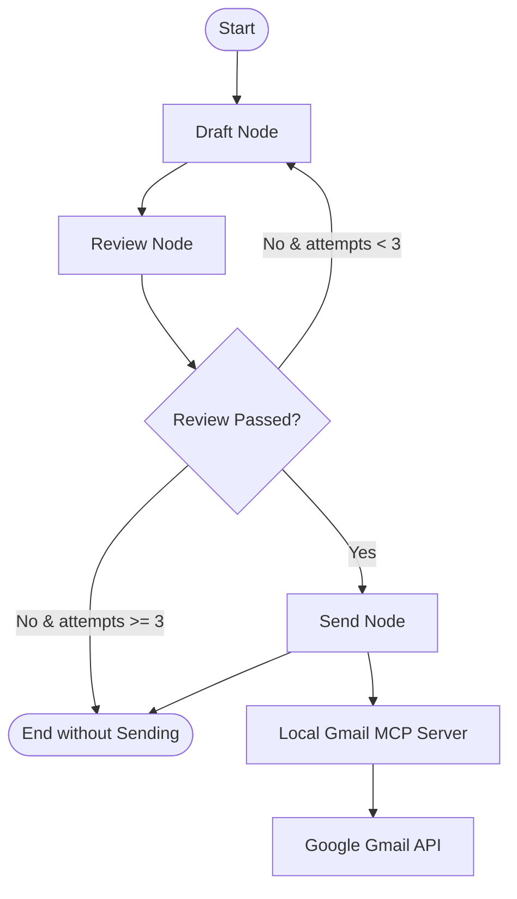

# Cold Email Agent via Gmail MCP - Documentation

This documentation details the architecture, design decisions, challenges resolved, and usage instructions for the LangGraph-based Cold Email Agent.

---

## 1. Purpose

The Cold Email Agent automates the process of writing, reviewing, and sending personalized cold emails (e.g., to professors, hiring managers, or companies). By using a Graph-based workflow, the agent acts as an autonomous pipeline that ensures quality checks are performed before any email is sent, preventing embarrassing typos, short content, or template placeholders from reaching recipients.

---

## 2. System Architecture

The project is built using a decoupled client-server architecture leveraging the **Model Context Protocol (MCP)** and **LangGraph**:



### Key Components
1.  **Gmail MCP Server (`gmail_mcp_server.py`)**:
    *   Exposes a Python-based FastMCP server over `stdio`.
    *   Registers a single `send_email` tool.
    *   Handles Google OAuth 2.0 credentials and generates/re-uses `token.json` for passwordless authorization.
2.  **LangGraph Workflow Agent (`gmail_agent.py`)**:
    *   **State**: Tracks the recipient details, draft subject/body, quality control feedback, and draft attempts.
    *   **Nodes**:
        *   `draft_node`: Uses the local Ollama LLM to generate email copies matching recipient names and academic/industry context.
        *   `review_node`: Programmatically validates word count and uses an LLM evaluator to detect generic layouts or template placeholders.
        *   `send_node`: Resolves the Gmail MCP server over stdio using `MultiServerMCPClient` and triggers `send_email`.

---

## 3. Design Decisions

*   **Custom Python MCP Server instead of NPM packages**:
    *   *Decision*: Rather than using external node packages (such as `gptscript-ai/gmail-mcp-server`), we built a custom FastMCP server in Python using `mcp.server.fastmcp.FastMCP`.
    *   *Rationale*: Eliminates third-party package dependencies, keeps everything in Python, and provides complete visibility into how Gmail OAuth and sending flows are handled.
*   **Local Ollama Fallback (`qwen2.5:1.5b`)**:
    *   *Decision*: Switched the primary LLM from Google Gemini API (`gemini-2.5-flash`) to a local Ollama model.
    *   *Rationale*: Protects the agent from running into free-tier quota limits (429 Resource Exhausted) during multi-turn review cycles.
*   **Separated Authentication CLI Argument**:
    *   *Decision*: Added a `python3 gmail_mcp_server.py auth` subcommand.
    *   *Rationale*: Since MCP servers communicate over stdio, any output to stdout during the interactive Google login prompt would corrupt the JSON-RPC communication stream. Running authentication separately guarantees that `token.json` is generated before starting the MCP server.

---

## 4. Challenges & Snags Hit

### 1. Gemini API Rate Limits (429 Resource Exhausted)
*   **Snag**: While executing the workflow, the Gemini Free Tier project hit its maximum limit of 20 daily requests, causing the script to crash at the `draft_node`.
*   **Resolution**: Integrated `Ollama(model="qwen2.5:1.5b")` as the main LLM. This provides a completely free, local, and reliable alternative without network limits.

### 2. MultiServerMCPClient Async Context Manager Incompatibility
*   **Snag**: Using `async with MultiServerMCPClient(...) as client:` resulted in a `NotImplementedError` because `MultiServerMCPClient` does not implement context manager protocols in the version of `langchain-mcp-adapters` installed.
*   **Resolution**: Refactored the connection to directly instantiate the client object and fetch tools asynchronously without using the context manager.

---

## 5. Usage & Execution Instructions

### Installation Prerequisites
Install the required libraries in your Python environment:
```bash
pip install google-auth-oauthlib google-api-python-client mcp langchain-mcp-adapters langgraph langchain-community
```

### Step 1: Place Google Cloud Credentials
Download your OAuth 2.0 client credentials JSON file from the Google Cloud Console and place it in the project root folder as:
`/home/arhan/Projects/AgenticAI/credentials.json`

### Step 2: Complete Google Authorization
Run the authentication script once to authorize your email account and create `token.json`:
```bash
python3 gmail_mcp_server.py auth
```
*Click the URL printed in the terminal, complete the sign-in in your browser, and wait for confirmation.*

### Step 3: Run the Cold Email Agent
To execute the LangGraph workflow and send a cold email, pass the recipient's email address as a CLI argument:
```bash
python3 -u gmail_agent.py rakeshkumar1169420007@gmail.com
```
